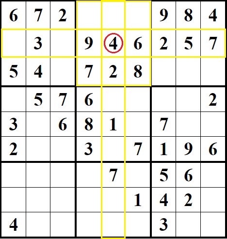
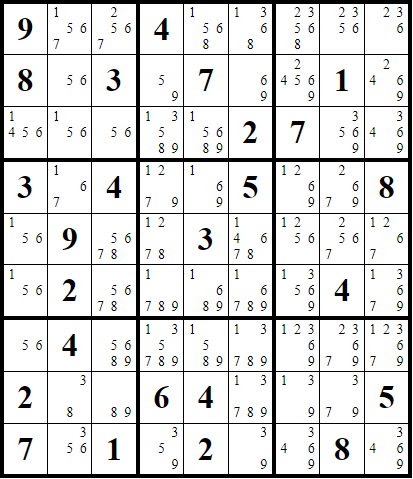
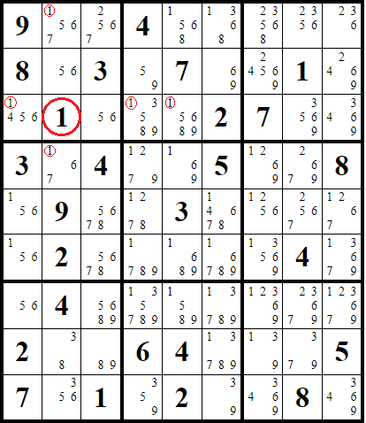
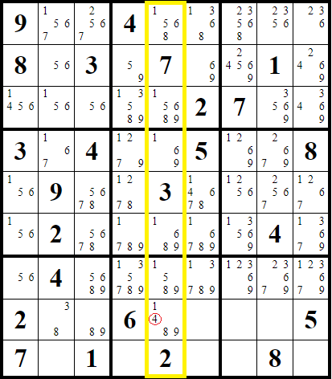

# Sudoku Solver
This project was created with the goal of solving any 9x9 Sudoku regardless of difficulty.

## Strategies

Various strategies are adopted to solve a sudoku, below list of those used by the program.
The more the difficulty increases the more strategies we should use.

#### Basic Strategy

The basic strategy consists in identifying, for each cell, its possible numbers, based on the numbers already present in the same row, in the same column and in the same "square". 
If there is only one possible number, then it will be the value of the cell.

### Possible Values

As the difficulty increases it will no longer be possible to find the value of a cell immediately, so we should write down the possible values for each cell and work with them.

Obviously the possible values will have to be updated every time we find the value of a cell.

In the example we found the number 1 (in the cell circled in red) and therefore we will remove the number 1 from the possible cell values in the same row, same column and same "square".

#### Basic Possible Values Strategy

The simplest strategy to adopt using the possible cell values is to check whether a number is repeated only once in a row, column or square.

In this example, among the possible values of the highlighted column, the number 4 is present only in one cell, therefore the value of that cell will necessarily be 4.

